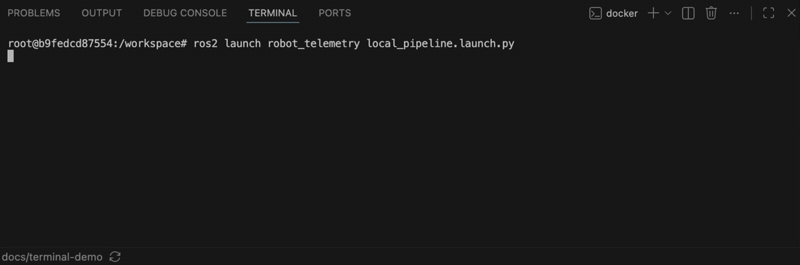

# Robot Telemetry Gateway

A small Python and ROS 2 project demonstrating telemetry freshness,
stale-signal recovery, and QoS trade-offs at the robot-to-platform boundary.

> **Status:** The simulator and gateway form a working local telemetry path.
> Position and battery signals are tracked independently through healthy,
> stale, and recovered transitions. QoS reliability is configurable; the
> compatibility experiment and final documentation are next.

## Why this project exists

I am building this project to deepen my hands-on Python and ROS 2 experience
while applying the production engineering practices I use in Java and
TypeScript systems.

The focus is deliberately narrow: build one understandable, tested telemetry
path and explore how it behaves when sensor updates stop and recover.

## Architecture

```text
ROS 2 simulator node
  ├── position telemetry (1 Hz)
  └── battery telemetry  (1 Hz)
              │
              ▼
Python gateway node
  ├── records measurement and receipt times
  ├── tracks signal freshness independently
  └── logs healthy, stale, and recovered transitions
```

The simulator pauses individual signals on a deterministic schedule. The
gateway detects each pause and recovery independently, without requiring
external hardware.

## Demo



The battery and position streams become stale and recover independently before
both ROS nodes shut down cleanly.

## Project goals

- Write clear, typed, idiomatic Python.
- Keep ROS 2 integration separate from testable domain logic.
- Compare reliable and best-effort ROS 2 QoS policies.
- Explain why telemetry and robot commands may need different delivery
  semantics.
- Provide a short, reproducible local demonstration and automated tests.

## Development setup

The development environment uses ROS 2 Jazzy on Ubuntu 24.04 in Docker. It has
been tested with Docker Desktop on Apple Silicon.

Build the development image from the repository root:

```bash
docker build --tag robot-telemetry-gateway:jazzy .
```

Start a shell with the repository mounted as a ROS workspace package:

```bash
./scripts/ros.sh
```

Build and test the package inside the container:

```bash
colcon build --symlink-install
colcon test --event-handlers console_direct+
colcon test-result --verbose
```

After building, source the workspace and launch the complete local pipeline:

```bash
source install/setup.bash
ros2 launch robot_telemetry local_pipeline.launch.py
```

The simulator and gateway run together until you stop them with `Ctrl+C`.
Both use reliable QoS by default. Select either `reliable` or `best_effort`
independently for the publisher and gateway:

```bash
ros2 launch robot_telemetry local_pipeline.launch.py \
  publisher_reliability:=best_effort \
  gateway_reliability:=best_effort
```

The container is removed when its shell exits, so its build artifacts last only
for that development session.

## Deliberately out of scope

- HTTP or WebSocket forwarding
- A fleet backend or persistent database
- Robot command handling
- Custom ROS messages
- Multi-robot discovery
- Production deployment and dashboards

Networking may be explored later, but only after the local ROS 2 pipeline is
working and tested.

## About

This project is part of my exploration of robotics-platform engineering. More
about my background and related work is available at [mrza.ch](https://mrza.ch/).

## License

This project is available under the [MIT License](LICENSE).
